# TD/Dev Documentation

## Creating Criterions

Create a new `spicyqc_config.py` :memo: file so we can create our first `Criterion`. We will start with the most simple Criterion as possible and iterate over it.

=== "python"
    ```python
    from spicy_qc import Criterion, show_spicyqc_dialog

    def verify_stuff(criterion: Criterion):
        print("Verifying Stuff...")
        print("Success!")

    criterion = Criterion(
        label="Simple Criterion",
        description="Criterion for demonstration purposes",
        verify_callback=verify_stuff
    )

    show_spicyqc_dialog(criterions=[criterion])
    ```

In this piece of code, we have done three things so far:

- Write the function that will be triggered when the `Verify` button is pressed.

    ??? question "What is the `criterion` argument?"
        For now, the `verify_stuff` function does basically nothing, but a `criterion` object will later be used to pass warnings and errors around.  

- Create a new Criterion, in which we fetch the function we wrote.
- Open the SpicyQC dialog, to which we provided our sole Criterion.

!!! success "Result"
    SpicyQC shows up, with a single Criterion that has a name, a description, and a working `Verify` button.

    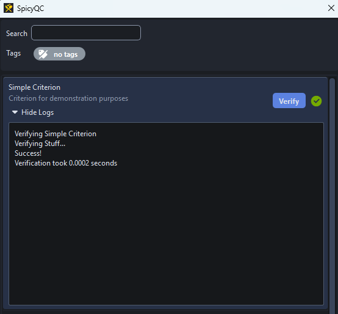

## Adding Warnings

The `criterion` argument of the `verify_stuff` function now comes into play. We can use it to raise warnings.

=== "python"
    ```python
    from spicy_qc import Criterion, Warning, show_spicyqc_dialog

    def verify_stuff(criterion: Criterion):
        print("Verifying Stuff...")
        criterion.add_warning(Warning("Oh no, something went wrong with a few elements in the scene"))
        criterion.add_warning(Warning(message='The object "Knife" has a problem', element="knife"))
        criterion.add_warning(Warning(message='The object "Spoon" has a problem', element="spoon"))
        criterion.add_warning(Warning(message='The object "Fork" has a problem', element="fork"))
        print("Failure...")

    criterion = Criterion(
        label="Simple Criterion",
        description="Criterion for demonstration purposes",
        verify_callback=verify_stuff
    )

    show_spicyqc_dialog(criterions=[criterion])
    ```

!!! success "Result"
    The `Verify` button now displays the  label, and the warnings can be read in the logs.

    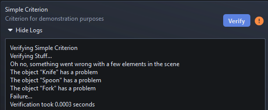


## Creating An Assistant

Let's now provide the user an Assistant widget to help him resolve the issues revealed by the verification process.

=== "python"
    ```python
    # Import additional objects and function to create the UI
    from spicy_qc import AssistantWidget, Criterion, CriterionStatus, Warning, show_spicyqc_dialog
    from PySide6.QtWidgets import QLabel, QPushButton, QSizePolicy, QVBoxLayout
    from functools import partial

    def verify_stuff(criterion: Criterion):
        ...

    # Create a PySide6 widget where you basically do anything you want
    class CustomAssistant(AssistantWidget):
        def __init__(self, criterion: Criterion):
            super().__init__(criterion)
            layout = QVBoxLayout(self)
            self.setSizePolicy(QSizePolicy(QSizePolicy.Policy.Fixed, QSizePolicy.Policy.Fixed))

            if self.criterion.status == CriterionStatus.WAITING:
                layout.addWidget(QLabel("The verification has not been done yet"))
                return

            for warning in self.criterion.warnings:
                if warning.element:
                    button = QPushButton(f"Fix {warning.element}")
                    layout.addWidget(button)
                    button.clicked.connect(partial(self.fix_element, warning.element))

        def fix_element(self, element):
            print(f"Fixing {element}")


    # Pass the newly created class to the Criterion, so it is added to the GUI
    criterion = Criterion(
        label="Simple Criterion",
        description="Criterion for demonstration purposes",
        verify_callback=verify_stuff,
        assistant_widget=CustomAssistant,
    )

    show_spicyqc_dialog(criterions=[criterion])
    ```

!!! success "Result"
    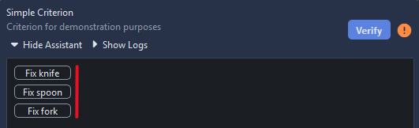

??? question "What is the purpose of `partial`?"
    See [functools.partial On Button Clicked Signal](#functoolspartial-on-button-clicked-signal)

### Monitoring Actions

Having working buttons is a good start, but a simple decorator will make it even better

=== "python"
    ```python
    from spicy_qc import monitor_action

    @monitor_action
    def fix_element(self, element):
        print(f"Fixing {element}")
    ```

!!! success "Result"
    Now, the lines that are printed out correcty end up in the logs

    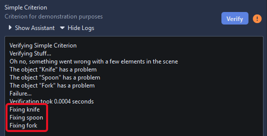

    Moreover, Exceptions will correctly be handled and sent to logs. A notification will also show up, so the error doesn't silently occur without the user noticing.

    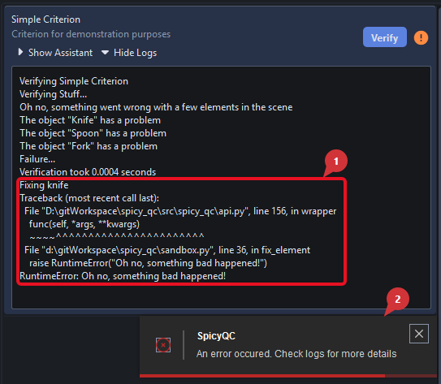


## Adding Documentation

To help the end user with comprehensive documentation, you can use the documentation argument when creating your `Criterion`

=== "python"
    ```python
    criterion = Criterion(
        label="Simple Criterion",
        description="Criterion for demonstration purposes",
        verify_callback=verify_stuff,
        assistant_widget=CustomAssistant,
        documentation="This documentation explains how the Criterion works",
    )
    ```

!!! success "A `Show Documentation` button now appears and displays your text"
    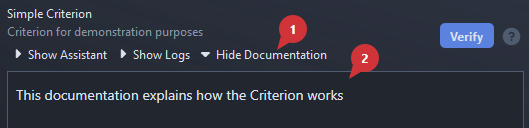

!!! tip
    The documentation widget uses the markdown syntax, so you can display way more than just text.  
    It also supports html tags and css properties, so you can get creative.

    For more information, see the [Markdown Reference](./markdown.md)
    
    === "python"
        ```python
        documentation = """
        # My Documentation

        **this text is bold**

        !!! tip
            This is a `Tip` admonition

        
        """

        criterion = Criterion(
            label="Simple Criterion",
            description="Criterion for demonstration purposes",
            verify_callback=verify_stuff,
            assistant_widget=CustomAssistant,
            documentation=documentation,
        )
        ```

        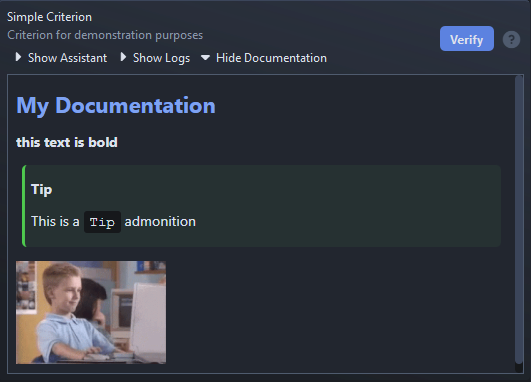


## Adding Tags

`Tags` are a useful way of regrouping Criterion into categories, so users can easily filter them.

To add a Tag to our Criterion, simply use the `tag` argument when instancing your Criterion.

```python
criterion = Criterion(
    label="Simple Criterion",
    description="Criterion for demonstration purposes",
    verify_callback=verify_stuff,
    assistant_widget=CustomAssistant,
    documentation=documentation,
    tags=["demo", "my first criterion"]
)
```

!!! success "Result"
    The newly created Tags will appear in the Filter Area. The Criterion will appear if one of the tags is selected.

    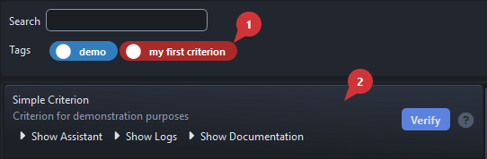

### Customizing Tags

When creating tags on the fly like we just did, tags are assigned a random color and a placeholder icon. Tags are actually fully customizable and allow a better user experience (in addition to a few style point :sunglasses:).

To achieve this, define `Tag` objects and fetch them to the `show_spicyqc_dialog` function.

```
from spicy_qc import Tag

tags = [
    Tag(
        tag="demo",
        tag_color="#25B920",
        tag_icon="fa5s.question-circle",
        tag_text_color="#070A2C",
        tag_icon_color="#070A2C",
    ),
    Tag(
        tag="my first criterion",
        tag_color="#C31010",
        tag_icon="ei.fire",
        tag_text_color="#FFD900",
        tag_icon_color="#FFD900",
    ),
]

show_spicyqc_dialog(criterions=[criterion], tags=tags)
```

!!! success "Result"
    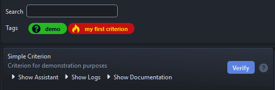

    **Important Note** : These colors were picked for demonstration purposes, please don't do this at home :pray:

### About QtAwesome Icons

SpicyQC uses QtAwesome for its menu icons. To browse available icons, open `qta-browser`, either from your python script, or from the virtual environment where `spicy-qc` is installed.

=== "python"
    ```python
    from spicy_qc import show_qta_browser

    show_qta_browser()
    ```

=== "venv"
    ```
    qta-browser
    ```

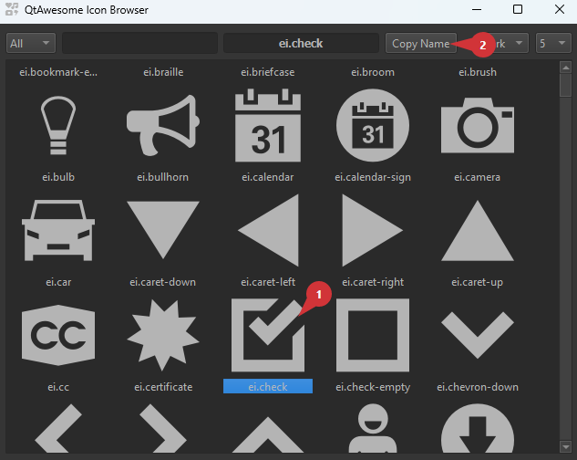

From there, you can select the icon of your choice and copy its code.

## Using A Configuration Directory

You now know how to create Criterions, but how about managing dozens or hundreds ?
SpicyQC has a way of creating an entire configuration by walking a directory, that should look something like this:

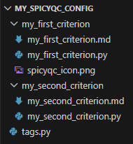

Let's build it from scratch.

- First, create a directory. For instance `my_spicyqc_config` :open_file_folder:
- In it, create a subfolder for each Criterion you want to create. For instance `my_first_criterion` :open_file_folder:
- In each subfolder:
    - Create a `.py` file that has **the same name as the parent folder**. For instance `my_first_criterion.py` :memo:

        !!! info ""
            This python file contains the definition of the Criterion, and its optional AssistantWidget

            === "my_first_criterion.py"
                ```python
                from functools import partial

                from PySide6.QtWidgets import QLabel, QPushButton, QSizePolicy, QVBoxLayout

                from spicy_qc import (
                    AssistantWidget,
                    Criterion,
                    CriterionStatus,
                    Warning,
                    monitor_action,
                )


                def verify_stuff(criterion: Criterion):
                    print("Verifying Stuff...")
                    criterion.add_warning(Warning("Oh no, something went wrong with a few elements in the scene"))
                    criterion.add_warning(Warning(message='The object "Knife" has a problem', element="knife"))
                    criterion.add_warning(Warning(message='The object "Spoon" has a problem', element="spoon"))
                    criterion.add_warning(Warning(message='The object "Fork" has a problem', element="fork"))
                    print("Failure...")


                class CustomAssistant(AssistantWidget):
                    def __init__(self, criterion: Criterion):
                        super().__init__(criterion)
                        layout = QVBoxLayout(self)
                        self.setSizePolicy(QSizePolicy(QSizePolicy.Policy.Fixed, QSizePolicy.Policy.Fixed))

                        if self.criterion.status == CriterionStatus.WAITING:
                            layout.addWidget(QLabel("The verification has not been done yet"))
                            return

                        for warning in self.criterion.warnings:
                            if warning.element:
                                button = QPushButton(f"Fix {warning.element}")
                                layout.addWidget(button)
                                button.clicked.connect(partial(self.fix_element, warning.element))

                    @monitor_action
                    def fix_element(self, element):
                        print(f"Fixing {element}")
                        raise RuntimeError("Oh no, something bad happened!")


                criterion = Criterion(
                    label="Simple Criterion",
                    description="Criterion for demonstration purposes",
                    verify_callback=verify_stuff,
                    assistant_widget=CustomAssistant,
                    tags=["demo", "my first criterion"],
                )

                ```
        
        !!! warning
            It is important that the variable that contains the Criterion is named **exactly `criterion`**

    - (Optional) Create a `.md` file that has **the same name as the parent folder**. For instance `my_first_criterion.md` :memo:

        !!! info
            This file contains the documentation or your Criterion.

            === "my_first_criterion.md"
                ```markdown
                # My First Criterion Documentation

                This is a separate documentation file to demonstrate how the configuration directory works.

                
                ```
    
    - (Optional) Images used by the documentation can be directly dropped into the `my_first_criterion` :open_file_folder: folder.
    
        !!! tip
            You may also create a subfolder (for instance `img`) to store your images. For more informations, see [Markdown Reference / Images](./markdown/#images)

- (Optional) In the `my_spicyqc_config` :open_file_folder: folder, you may also add a `tags.py` file.

    !!! info
        This file contains the customization of your `Tags`

        === "tags.py"
            ```python
            from spicy_qc import Tag

            tags = [
                Tag(
                    tag="demo",
                    tag_color="#25B920",
                    tag_icon="fa5s.question-circle",
                    tag_text_color="#070A2C",
                    tag_icon_color="#070A2C",
                ),
                Tag(
                    tag="my first criterion",
                    tag_color="#C31010",
                    tag_icon="ei.fire",
                    tag_text_color="#FFD900",
                    tag_icon_color="#FFD900",
                ),
                Tag(
                    tag="my second criterion",
                    tag_color="#FFD900",
                    tag_icon="ei.fire",
                    tag_text_color="#C31010",
                    tag_icon_color="#C31010",
                ),
            ]
            ```
        
        !!! warning
            It is important that the variable that contains the Tag list is named **exactly `tags`**
    
At this point, you can add as many Criterions as you want.


!!! success "Result"
    To see the result, fetch your configuration and open SpicyQC.
    === "python"
        ```python
        from spicy_qc import get_config_from_path, get_qt_app, show_spicyqc_dialog

        app = get_qt_app()
        criterions, tags = get_config_from_path(r"D:\gitWorkspace\spicy_qc\my_spicyqc_config")
        show_spicyqc_dialog(criterions, tags)
        ```

    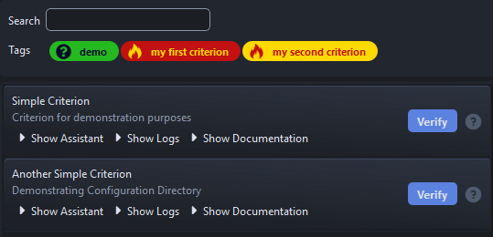

### Example Configuration Directory

SpicyQC provides an example configuration directory in "spicy-qc/example_criterions" :open_file_folder:

Feel free to look inside to see how Criterions, Tags, and Documentations are setup.

!!! tip "The `extensive_example` Criterion basically shows all the features of SpicyQC, if you are looking for a boilerplate, it looks like a good place to start with."

The example config of SpicyQC can be opened like this:

=== "python"
    ```python
    from spicy_qc import example

    example()
    ```

=== "uv"
    ```
    uv run spicy-qc-example
    ```


## Filtering

As you will add a lot of Criterions and Tags, SpicyQC may stard to become overwhelming for users. Hopefully, there are several main ways to make the UI less bloated, and to nudge the user into using specific Criterions.

### Selection Preset

You can specify which tags will already been selected when SpicyQC opens using the `tag_selection` argument.

=== "python"
    ```python
    from spicy_qc import get_config_from_path, get_qt_app, show_spicyqc_dialog

    app = get_qt_app()
    criterions, tags = get_config_from_path(r"D:\gitWorkspace\spicy_qc\my_spicyqc_config")
    show_spicyqc_dialog(criterions, tags, tag_selection=["my first criterion"])
    ```

!!! success "Result"
    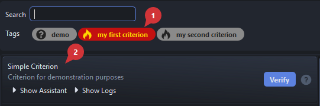

### Whitelisting And Blacklisting Tags

You can specify Tags that won't show altogether when SpicyQC opens using the `tag_whitelist` and `tag_blacklist` arguments.

=== "python"
    ```python
    from spicy_qc import get_config_from_path, get_qt_app, show_spicyqc_dialog

    app = get_qt_app()
    criterions, tags = get_config_from_path(r"D:\gitWorkspace\spicy_qc\my_spicyqc_config")
    show_spicyqc_dialog(criterions, tags, tag_whitelist=["my first criterion"])
    ```

!!! success "Result"
    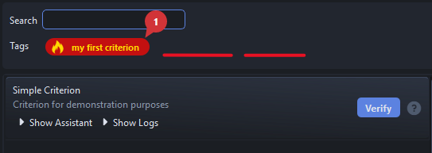

!!! tip
    The difference between these two options is that the `tag_selection` argument selects the Tags, but the others can still be accessed by the user, while the `tag_whitelist` and `tag_blacklist` arguments prevent Criterions from appearing altogether.

### Locked Criterion Sets

Sometimes, you just don't want the user to filter out Criterions, and you need to restrict the scope of what can be done with SpicyQC. To achieve this, you can use the `lock` attribute, and the filter area will be gone.

=== "python"
    ```python
    from spicy_qc import get_config_from_path, get_qt_app, show_spicyqc_dialog

    app = get_qt_app()
    criterions, tags = get_config_from_path(r"D:\gitWorkspace\spicy_qc\my_spicyqc_config")
    show_spicyqc_dialog(criterions, tags, tag_whitelist=["my first criterion"], lock=True)
    ```

!!! success "Result"
    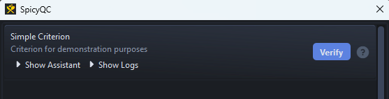


## Tips And Tricks

### Widget Style

SpicyQC's stylesheet can use properties to give a specific look to widgets.
Here are a few examples:

```python
# QFrame
frame = QFrame()
frame.setProperty("depth", "1")

# QLabel
h1_label = QLabel("H1 Heading")
h1_label.setProperty("tag", "H1")
h2_label = QLabel("H2 Heading")
h2_label.setProperty("tag", "H2")
important_label = QLabel("important text")
important_label.setProperty("status", "important")
warning_label = QLabel("warning text")
warning_label.setProperty("status", "warning")
error_label = QLabel("error text")
error_label.setProperty("status", "error")
secondary_label = QLabel("secondary text")
secondary_label.setProperty("status", "secondary")
ok_label = QLabel("ok text")
ok_label.setProperty("status", "ok")

# QPushButton
important_button = QPushButton("Important Button")
important_button.setProperty("status", "important")
ok_button = QPushButton("Ok Button")
ok_button.setProperty("status", "ok")
danger_button = QPushButton("Danger Button")
danger_button.setProperty("status", "danger")
warning_button = QPushButton("Warning Button")
warning_button.setProperty("status", "warning")
error_button = QPushButton("Error Button")
error_button.setProperty("status", "error")
```

!!! success "Result"
    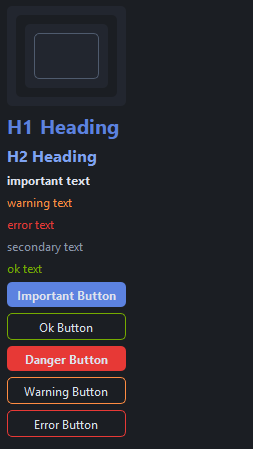


### functools.partial On Button Clicked Signal

QPushButtons are normally not able to send arguments when clicked, which is a shame, since you may have a button for each of your element that needs to be fixed.

Hopefully, there is a workaround : `functools.partial()`, which wraps around a function to enforce specific argument values. In out case, passing the element to fix to the function that will be triggered when the button is pressed.

=== "python"
    ```python
    for warning in self.criterion.warnings:
        if warning.element:
            button = QPushButton(f"Fix {warning.element}")
            layout.addWidget(button)
            button.clicked.connect(partial(self.fix_element, warning.element))
    
    @monitor_action
    def fix_element(self, element):
        print(f"Fixing {element}")
    ```

