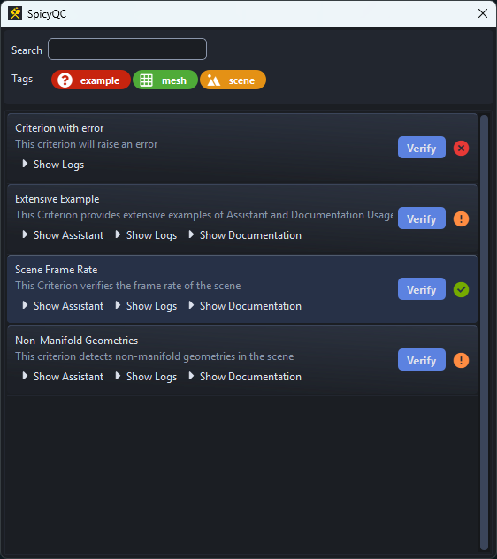

# SpicyQC Documentation

## What is SpicyQC?

SpicyQC is a quality control system with clear visual feedback, designed to help teams quickly identify, understand, and resolve issues during production.

It is based on PySide6, making it easy to implement in most of the DCCs used in the Animation/VFX industry.

## What makes SpicyQC so spicy?

Here are the key design choices that make SpicyQC different from other solutions:

- :heart: Its core philosophy is to make the Quality Control as clear as possible for the end-user by providing fixing assistance and beautiful documentation instead of just logs (which can be hard to decipher for artists).
- :balance_scale: It tries to strike a balance between ease of setup for the TDs and ease of use for the artists.
- :package: Its modular design allows the user to run only Criterions that are relevant to the current task at hand.
- :money_with_wings: It is free and open-source.

## What SpicyQC Is Not?

- SpicyQC is **not a "one-button-fix-all" solution**: Experience shows this kind of design makes the artist press the "Fix All" button and pray, without understanding what happens under the hood. Instead, the assistant aims at making fixes more enlightened and deliberate.
- SpicyQC is **not an exporter**: its sole purpose is to verify Quality Criterions. We believe it is smarter to decouple the "quality check" and the "publish" steps. 

---

!!! info ""
    <a href="Next Section"> 
 [Next Section : Quick Start](./quickstart.md) 
