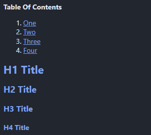
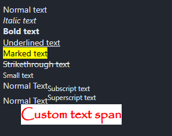
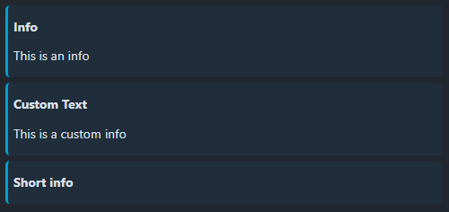
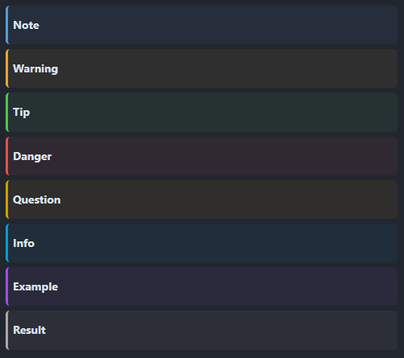
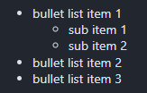
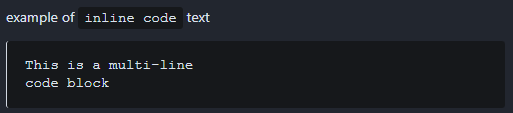
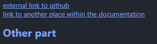
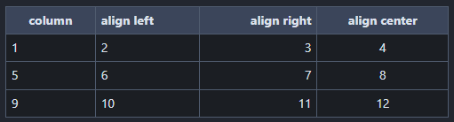

# Markdown Reference

## Title

```markdown
# H1 Title
## H2 Title
### H3 Title
#### H4 Title
```


## Table Of Contents

```markdown
**Table Of Contents**

1. [One](#h1-title)
2. [Two](#h2-title)
3. [Three](#h3-title)
4. [Four](#h4-title)

# H1 Title
## H2 Title
### H3 Title
#### H4 Title
```

!!! info
    The link to you title must be written in lower case, and the spaces must be replaced with `-`



## Text Style

```markdown
Normal text
*Italic text*
**Bold text**
<u>Underlined text</u>
<mark>Marked text</mark>
<del>Strikethrough text</del>
<small>Small text</small>
Normal Text<sub>Subscript text</sub>
Normal Text<sup>Superscript text</sup>
<span style="color:#FF0000; background-color:#FFFFFF; font-family:Papyrus; font-size:22px; font-weight: bold; margin: 30px">Custom text span</span>
```



!!! tip
    As demonstrated in these examples, you can use *most* html tags and css properties (warning: a few are not supported). Feel free to be creative.

## Images

```markdown


```


!!! info "About file paths"
    These examples assume the images are next to the python file, but there is more you can do: 

    ```markdown
    next to the python file:
    

    relative to the python file:
    

    hard-written path:
    
    ```


## Admonitions

```markdown
!!! info
    This is an info

!!! info "Custom Text"
    This is a custom info
```



!!! tip Admonition Classes
    Various abmonitions are available, here is the complete list:
    
    - note
    - warning
    - tip
    - danger
    - question
    - info
    - example
    - result

    

## Quote Block

```markdown
> Quote Block
```


## Bullet List

```markdown
- bullet list item 1
    - sub item 1
    - sub item 2
- bullet list item 2
- bullet list item 3
```



## Code

```
 example of `inline code` text

 ```
 This is a multi-line
 code block
 ```
```



## Links

```markdown
[external link to github](https://github.com/bigcompany-public/spicy_qc)
[link to another place within the documentation](#other-part)

# Other part
```



## Emojis

```markdown
:rocket:
:smile:
:warning:
:memo:
```


!!! info "Here is a [full list of available emojis](https://dev.to/nikolab/complete-list-of-github-markdown-emoji-markup-5aia)"

## Table

```markdown
| column | align left | align right | align center |
|---|:--|--:|:-:|
| 1 | 2 | 3 | 4 |
| 5 | 6 | 7 | 8 |
| 9 | 10 | 11 | 12 |
```



## Known Limitations

### Youtube Video Integration

At the moment, Youtube video integration does not work properly.
The following code block is *valid*, but youtube refuses the connection because PySide6's QWebEngineView is not recognized as a proper web browser.

```
<iframe width="560" height="315"
src="https://www.youtube.com/embed/dQw4w9WgXcQ"
title="YouTube video player"
frameborder="0"
allowfullscreen>
</iframe>
```