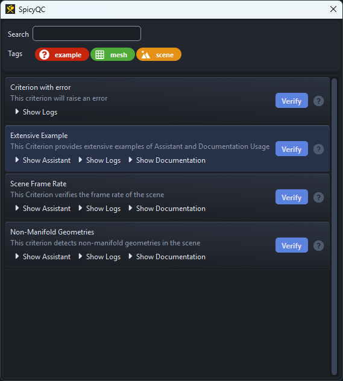

## Requirements

- Python >= 3.9

## Installation
Use your preferred package installer:

=== "pip"
    ```
    pip install spicy-qc
    ```

=== "uv"
    ```
    uv add spicy-qc
    ```

=== "poetry"
    ```
    poetry add spicy-qc
    ```

## Quick Start

To try it quickly, SpicyQC provides an example configuration for demonstration purposes.
As Criterions have no real value in a vacuum, these examples are pure placeholders to demonstrate what they **could** be given the context of a 3D scene or a file to inspect.

=== "python"
    ```python
    from spicy_qc import example

    example()
    ```

=== "uv"
    ```
    uv run spicy-qc-example
    ```



---

!!! info ""
    <a href="Next Section"> <div style="text-align: right; font-weight: bold"> [Next Section : User Documentation](./user_documentation.md) </div>