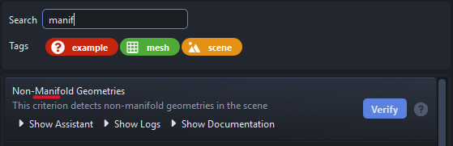
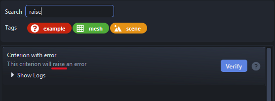
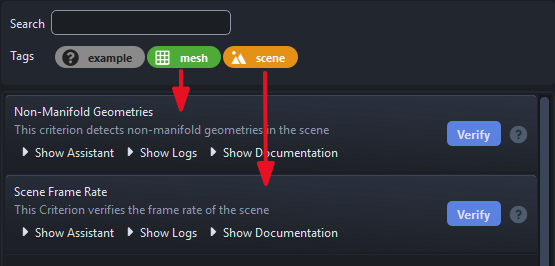
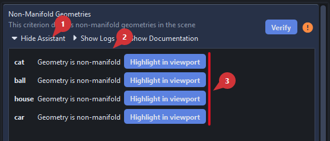
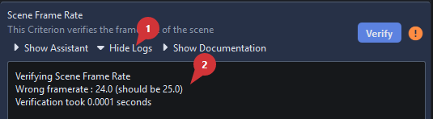
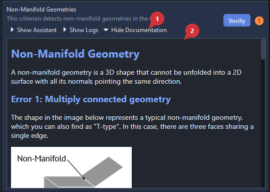
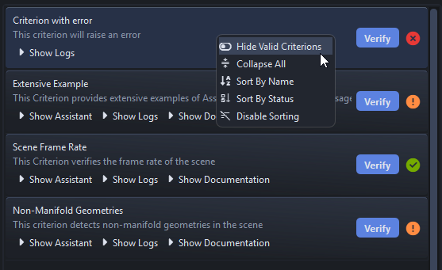

# User Documentation

SpicyQC provides users with a list of `Criterions`, each Criterion being a quality criterion that should be enforced so your work is considered valid.

Criterions are grouped by tags, which help you choose the Criterions relevant to the current task instead of verifying everything blindly.

## User Interface

SpicyQC's user interface is split into two parts:

- :one: The filtering section, where you can search for Criterions that match a specific name or a set of specific Tags
- :two: The Criterion section, where the matching Criterions are displayed

??? question "I can't see the filtering section"
    SpicyQC has two interface modes. If you don't see the filtering section, it most likely means that the person who set up SpicyQC wanted to enforce a specific set of Criterions.

## Filtering

### Search Bar

The search bar can be used to look for specific patterns.

!!! tip "The search bar also looks for matching patterns in the Criterion's description."
    

### Tags

`Criterions` can have one or more `Tags` applied to them. When clicking on a Tag, SpicyQC shows the Criterions that have any of the selected Tag.

!!! tip "Selecting Multiple Tags"

    The Tag Filter has an extended selection mode; the following shortcuts are available:

    - `Ctrl` + `click` -> additive selection
    - `Shift` + `click` -> contiguous selection
    - `Ctrl` + `A` -> Select all
    - `Shift` + `up/down arrow` -> Extend selection up/down
    - `Ctrl` + `Space` -> Unselect last selected item

## Verification

To verify a Criterion, simply press the `Verify` button. The label next to the button shows the result:

-  The verification has not been triggered yet
-  Everything worked fine
-  The verification reported one or more `Warnings`
-  The verification function crashed

??? question "What is the difference between  and ?"
    -  A Warning means the Criterion successfully scanned your scene and identified one or more issues.

    -  An Error, on the other hand, means the Criterion **failed** to inspect the scene and crashed at some point.

    The difference is important because a crash means the Criterion did not complete its scan and therefore could not identify issues or configure the assistant to help solve them.

!!! tip "Verifying Multiple Criterions"

    The Criterion section has an extended selection mode; the following shortcuts are available:

    - `Ctrl` + `click` -> additive selection
    - `Shift` + `click` -> contiguous selection
    - `Ctrl` + `A` -> Select all
    - `Shift` + `up/down arrow` -> Extend selection up/down
    - `Ctrl` + `Space` -> Unselect last selected item

    When the `Verify` button is pressed, all selected Criterions are verified at once.

## Fixing The Mistakes

Each Criterion may have an `Assistant` to help you solve the problems raised by the verification.

- :one: Click on the `Show Assistant` button
- :two: The Assistant Area will appear
- :three: The contents of the Assistant vary from one Criterion to another. That is SpicyQC's main strength: depending on the need at hand, the Assistant can be as simple as a button or provide thorough troubleshooting, highlighting, and fixing features.

## Logs

During the execution of the verification, all logs are collected and can be read by clicking the `Show Logs` button.

## Documentation

Each Criterion may have `Documentation` to help you understand how the Criterion works and how the problem should be solved. It can be expanded by clicking the `Show Documentation` button.

## Contextual Menu

Right-clicking in the Criterion area shows extra options to help you sort and filter the Criterions.

---

!!! info ""
    <a href="Next Section"> 
 [Next Section : TD/Dev Documentation](./dev_documentation.md) 
