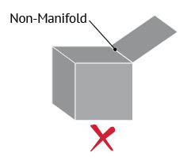
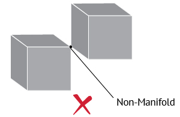
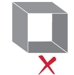
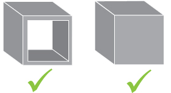
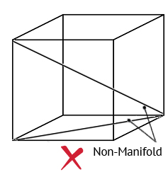
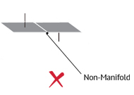

# Non-Manifold Geometry

A non-manifold geometry is a 3D shape that cannot be unfolded into a 2D surface with all its normals pointing the same direction.

## Error 1: Multiply connected geometry

The shape in the image below represents a typical non-manifold geometry, which you can also find as "T-type". In this case, there are three faces sharing a single edge.

Correcting non-manifold issues like this is easy: you should eliminate the non-manifold surface either by giving it volume or by deleting it completely.

## Error 2: Several surfaces connected to a single vertex

In the following picture, we see another common non-manifold geometry, which is often called "bow-type". In this case, there are more than two surfaces connected to a vertex. This is practically impossible, as there cannot be multiple faces sharing a common vertex but no edge.

Non-manifold error for multiple surfaces connected to a vertex
This error could be eliminated by either disconnecting the cubes from each other or by deleting one of them completely.

## Error 3: Open objects

This model represents a cube with surfaces with zero volume, as well as there are two missing surfaces. In the real world, this model cannot exist as it is.

In order to fix this geometry, you have two alternatives. Either to adjust the wall thickness of the box or to close the box with adding two new surfaces. In both cases, the cube has a valid volume and it can be 3D printed.

 

## Error 4: Internal faces

In the following image, we see the wireframe of a cube. From this perspective, we see an internal face that is totally unnecessary.

This error can be easily fixed by just deleting the internal face. If you do not delete that face, the software of the 3D printer will have difficulty in reading your file.

 

## Error 5: Opposite normals

In this example, we see a single shape with two adjacent faces which have opposite normals. This error could be hard to detect, as it is the least obvious one.

Once you detect the error, it is easy to fix it, by just reversing the normals, so that they point the same direction.